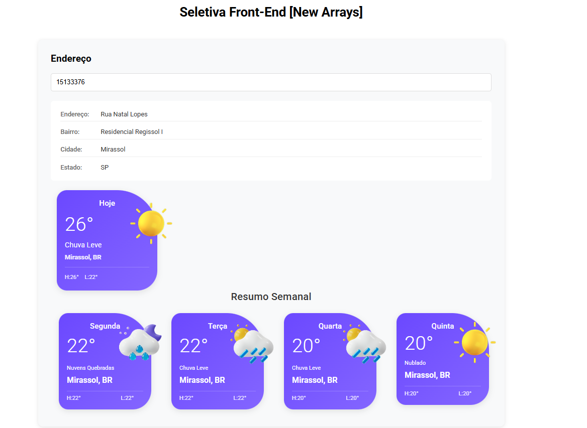

# Aplicação de Consulta de Endereço e Clima

<p align="center">
   

  

  

  <br>
  
  <a href="https://www.codacy.com/manual/Gabriel4420/seletiva-frontend-new-arrays?utm_source=github.com&amp;utm_medium=referral&amp;utm_content=Gabriel4420/seletiva-frontend-new-arrays&amp;utm_campaign=Badge_Grade">
    
  </a>
  
  

  <a href="https://www.linkedin.com/in/gabriel-rodrigues-perez-2069b072/">
    
  </a>
</p>



## Visão Geral

Este projeto é uma aplicação web desenvolvida para o processo seletivo da New Arrays. Ele combina funcionalidades de consulta de endereço com exibição de informações climáticas, construído usando Angular.

## Funcionalidades

- Consulta de CEP
- Exibição detalhada de informações de endereço
- Condições climáticas atuais
- Previsão do tempo para 4 dias
- Design responsivo para todos os dispositivos
- Ícones climáticos dinâmicos
- Exibição de temperatura em Celsius
- Suporte ao idioma português

## Tecnologias Utilizadas

- Angular 17
- TypeScript
- SCSS
- API OpenWeather
- API ViaCEP

## Como Começar

### Pré-requisitos

- Node.js (v18 ou superior)
- npm (Gerenciador de Pacotes do Node)
- Angular CLI

## Instalação

1. Clone o repositório

```bash

git clone

```

2. Instale as dependencias do projeto

```bash

npm install

```

3. Rode o projeto

```bash

ng serve

```

Abra seu navegador e acesse <http://localhost:4200>

## Como Usar

### Consulta de Endereço

1. Digite um CEP válido no campo de entrada
2. A aplicação irá automaticamente:
   - Buscar e exibir o endereço correspondente
   - Mostrar as condições climáticas atuais
   - Exibir uma previsão do tempo de 4 dias para a localidade

### Exibição do Clima

As informações climáticas incluem:

- Temperatura atual
- Condições meteorológicas
- Temperaturas máxima e mínima
- Dia da semana
- Nome da cidade

## Integração com APIs

A aplicação integra-se com duas APIs principais:

- ViaCEP : Para consulta de endereço baseada no CEP
- OpenWeather : Para informações climáticas e previsões

## Estrutura do Projeto

O projeto segue uma estrutura modular, organizada em componentes principais:

src/
├── app/
│   ├── address-form/
│   ├── weather-display/
│   ├── weather-forecast-grid/
│   └── pipes/
└── public/
    └── images/

### Componentes

#### Componente de Formulário de Endereço

- Gerencia entrada do CEP
- Controla exibição do endereço
- Coordena busca de dados climáticos

#### Componente de Exibição do Clima

- Mostra condições climáticas atuais
- Exibe ícones climáticos dinâmicos
- Apresenta informações de temperatura

#### Componente de Grade de Previsão

- Exibe previsão do tempo para 4 dias
- Mostra variações de temperatura diárias
- Inclui condições climáticas para cada dia

## Estilização

- Design responsivo usando SCSS
- Cards climáticos personalizados com gradientes
- Ajustes dinâmicos de layout para diferentes tamanhos de tela
- Família de fonte Roboto para melhor legibilidade

<h4 align="center">
  Feito com ❤️ por Gabriel Rodrigues 👋️ <a href="mailto:gabriel_rodrigues_perez@hotmail.com">Entre em contato!</a>
</h4>

<p align="center">

  <a href="https://www.linkedin.com/in/gabriel-rodrigues-perez-2069b072/">
    
  </a>
  <a href="https://www.facebook.com/gabriel.rodrigues.perez">
    
  </a>
  <a href="https://www.instagram.com/gabriel_rodrigues_perez/">
    
  </a>
  
</p>
